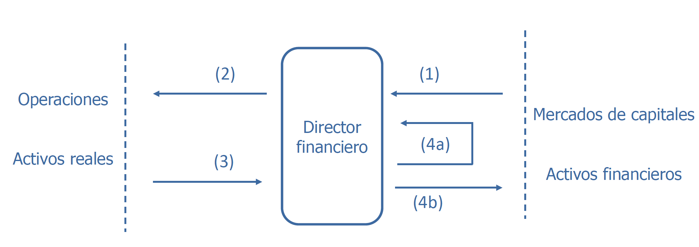
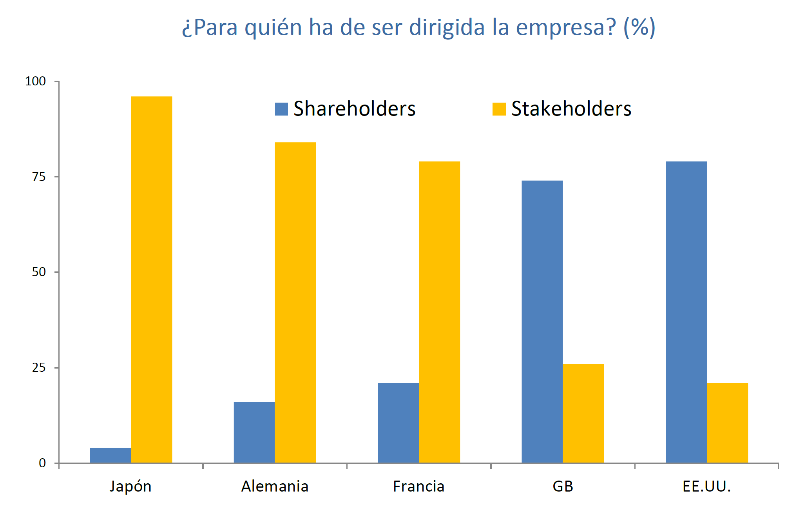
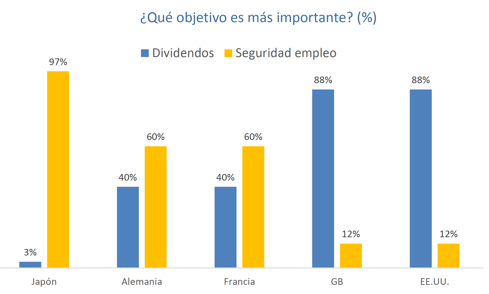

# Tema 1 - Introducción

**Funciones de un director financiero de una empresa:**

El director financiero está en el medio del activo y el pasivo:

1. Capta los recursos financieros de los mercados (**decisión de financiación: cómo me financio**)
2. Invertir esos recursos financieros en proyectos de inversión (**decisión de inversión: en qué invierto**)
3. Los proyectos de inversión generan flujos de tesorería.
4. El director financiero debe elegir qué hacer con la tesorería:
      1. Reinvertir la tesorería en la empresa
      2. Restituir la tesorería (a los inversores si la financiación es propia o a los bancos si la financiación es ajena)

El director financiero toma decisiones de inversión y de financiación:

- Las **decisiones de inversión** contribuyen a crear la **estructura económica de la empresa** {++(activo)++}.
- Las **decisiones de financiación** contribuyen a crear la **estructura financiera de la empresa** {++(pasivo)++}.

Nos dedicaremos a la **estructura financiera**, también llamada estructura de capital. {++Nos dará una combinación óptima de recursos óptimos y recursos ajenos.++}

## Conceptos

- **Equilibrio rentabilidad riesgo:** la rentabilidad es la *capacidad de generar rendimientos*. Se mide por la esperanza matemática. El riesgo es la *posibilidad de no obtener la rentabilidad esperada*. Se mide por la varianza o por la desviación típica.
- **Riesgo y diversificación:** los activos reales crean riesgo económico[^1], que ^^se evalúa en términos de variabilidad de los beneficios^^. El riesgo financiero se origina por la forma de financiación. Depende de las decisiones del director financiero.
- **Valor del dinero en el tiempo:** basado en la premisa de que cualquier agente económico prefiere un dinero hoy que un dinero en el futuro. *Vale más una unidad monetaria hoy que una unidad monetaria mañana*.
- **Tesorería vs beneficio:** aunque haya muchos beneficios, si en un momento no tenemos tesorería y hay que hacer frente a obligaciones de pago, la empresa se va a pique.
- **Flujos incrementales:**  repasar esto, ha dado rodeos
- **Mercados de productos competitivos:** cualquier mercado es competitivo si existe una cantidad muy grande de compradores y vendedores. Ninguno de ellos por separado no puede influir en el precio del producto.
- **Mercados de capitales eficientes:** el precio del mercado de un título es una estimación correcta del valor teórico o intrínseco del título. El precio del mercado de un título es su precio de cotización, es el precio al que se compra y se vende. El valor teórico o intrínseco es el valor actual de todos los flujos que genera ese título. En un mercado ineficiente se produce el efecto del **arbitraje**, por el que se ajustan los precios y el mercado se vuelve eficiente.
    - {++Otro aspecto de la eficiencia es la información++}: toda la información debe ser correcta y a disposición de todos.
        - `Eficiencia débil` - los precios de los títulos reflejan toda la información histórica de esos títulos
        - `Eficiencia intermedia` - los precios de los títulos reflejan además la información publicada
        - `Eficiencia fuerte` - los precios de los títulos reflejan además la información privada
- **Directivos-accionistas:** un accionista quiere dividendos, el director financiero quiere maximizar el valor de la empresa. Teoría financiera de la agencia.
- **No neutralidad de los impuestos:** ==un impuesto es neutral si no distorsiona las decisiones de los agentes económicos. En la realidad los impuestos no son neutrales.==

!!! tip "Beneficios"
    Siempre hablaremos de beneficios netos, antes de aplicar impuestos.

!!! success "Tipo de Interés"
    **Tipo de Interés:** tasa de retorno que refleja la relación de una cantidad de dinero en diferentes instantes de tiempo. Se puede considerar también como un coste de oportunidad

    {>>No puedo usar ese dinero mientras lo tengo depositado en el banco<<}

!!! bug "EFE"
    El director financiero tiene que estar pendiente de la tesorería, ya que aunque la empresa tenga muchos beneficios, si nuestra tesorería es 0 y tenemos que pagar a los proveedores, se va a pique.

    Para ello hay que estar pendiente del `Estado de Flujos de Efectivo`, que recoge todos los cambios de tesorería.

Conceptos nuevos:

- Riesgo económico: riesgo asociado a las operaciones de la empresa, es independiente de su financiación. Se evalúa en términos de variabilidad de los beneficios. Los activos reales (maquinaria) crean riesgo económico. *Ejemplo: Si la empresa fabrica botellas, el **riesgo económico** sería el riesgo de que el mercado ya no demande botellas y la empresa se vaya a pique.*

## Ámbito y objetivo de la dirección financiera de la empresa

### Accionistas vs Partícipes

- 🟨 **Stakeholders:** partícipes de la empresa (directivos, proveedores, clientes, Hacienda Pública, etc.)
- 🟦 **Shareholders:** accionistas, propietarios de la empresa

### Ámbito y objetivo

!!! quote "Teoría de la agencia"
    La empresa es un nexo de contratos entre los partícipes de la empresa.

Preeminencia de la creación de valor (limitaciones del beneficio):

- Múltiples periodos. *Ej: considerar 10 años*.
- Manipulación del beneficio. *Ej: durante un año no hace el mantenimiento durante ese año para aumentar beneficios, lo que generaría problemas a largo plazo porque se romperá la maquinaria*.
- Riesgo. Se mide por la variabilidad del beneficio.
- Divergencia de intereses. Los directivos piensan en la creación de valor en la empresa pero los accionistas sólo piensan en los dividendos. También dentro de los accionistas: los mayoritarios quieren aumentar el valor de la empresa (y de sus acciones) y los minoritarios quieren dividendos.

### Creación de valor para los accionistas (shareholders)

- Dificultad de establecer un objetivo corporativo (maximización en múltiples dimensiones).
- Maximización del valor a largo plazo.
- El mercado como marco de asignación de recursos. El mercado es el marco de valoración de títulos.
- Relación entre valor a largo plazo de la empresa y de las acciones.

El mercado primario es el mercado de emisión, en el que se ponen en circulación los títulos de las compañias.

El mercado secundario es donde se compran y se venden los títulos.

### Creación de valor para los partícipes (stakeholders)

- Debilidades del enfoque basado en los accionistas
- Capital reputacional. El cumplimiento de los contratos crea valor
- Valor para el accionista y contratos implícitos

### Relación enter ambos enfoques

**En ambos enfoques la creación de valor es una condición necesaria.**
