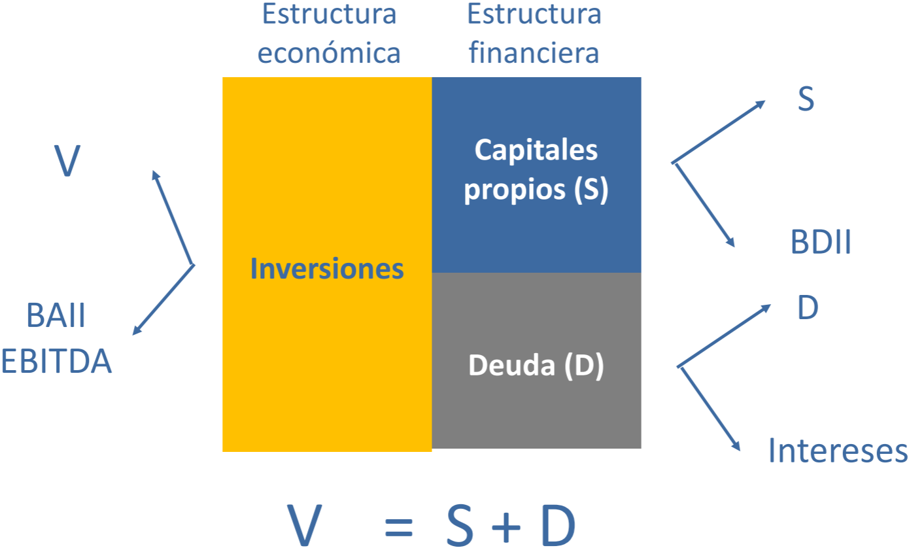

# Tema 2 - La estructura de financiación I

## 1. La estructura financiera de la empresa

Es el conjunto de decisiones relativas a la obtención de recursos

Tipos:

- **Según la propiedad:** ^^propios^^ (*capital social, reservas, autofinanciación...*) o ^^ajenos^^ (*créditos, préstamos, proveedores, obligaciones, leasing...*)
- **Según el periodo:** ^^permanentes^^ o ^^corrientes^^
- **Según el origen:** ^^externos^^ (*capital social, obligaciones, préstamos...*) o ^^internos^^ (*beneficios retenidos, venta de activos, proveedores...*)

||Propios|Ajenos|Internos|Externos|Permanentes|Corrientes|
|--|:--:|:--:|:--:|:--:|:--:|:--:|
|Póliza de crédito||:octicons-x-16:||:octicons-x-16:|:octicons-x-16:|:octicons-x-16:|
|Beneficio retenido|:octicons-x-16:||:octicons-x-16:||:octicons-x-16:||
|Ampliación de capital|:octicons-x-16:|||:octicons-x-16:|:octicons-x-16:||
|Proveedores||:octicons-x-16:|:octicons-x-16:|||:octicons-x-16:|
|Leasing||:octicons-x-16:||:octicons-x-16:|:octicons-x-16:||
|Obligaciones convertidas en acciones||:octicons-x-16:||:octicons-x-16:|:octicons-x-16:||
|Venta de activos|:octicons-x-16:||:octicons-x-16:||:octicons-x-16:||

Fondo de rotación = Fondo de maniobra = PN - AC = AC - PC = PF - AF

TODO: contrastar fórmula de arriba. Viene de Nadia.
{.red}

- **BAII:** beneficio antes de intereses e impuestos
- **BDII:** beneficio después de intereses e impuestos
- **EBITDA:** Beneficio - ITDA = EBITDA
    - Intereses
    - Tax - Impuestos
    - Depreciaciones
    - Amortizaciones
- **r:** intereses

$V=S+D$

$BAII=BDII+r_d→BDII=BN=BAII-r_d$

### Grado de apalancamiento

## 2. Riesgo y apalancamiento

## 3. La posición tradicional

## 4. Estructura de capital en mercados perfectos: las proposiciones de medigliani y miller
