# Tema 2 - La estructura de financiación I

## 1. La estructura financiera de la empresa

Es el conjunto de decisiones relativas a la obtención de recursos

Tipos:

- **Según la propiedad:** ^^propios^^ (*capital social, reservas, autofinanciación...*) o ^^ajenos^^ (*créditos, préstamos, proveedores, obligaciones, leasing...*)
- **Según el periodo:** ^^permanentes^^ o ^^corrientes^^
- **Según el origen:** ^^externos^^ (*capital social, obligaciones, préstamos...*) o ^^internos^^ (*beneficios retenidos, venta de activos, proveedores...*)

||Propios|Ajenos|Internos|Externos|Permanentes|Corrientes|
|--|:--:|:--:|:--:|:--:|:--:|:--:|
|Póliza de crédito||:octicons-x-16:||:octicons-x-16:|:octicons-x-16:|:octicons-x-16:|
|Beneficio retenido|:octicons-x-16:||:octicons-x-16:||:octicons-x-16:||
|Ampliación de capital|:octicons-x-16:|||:octicons-x-16:|:octicons-x-16:||
|Proveedores||:octicons-x-16:|:octicons-x-16:|||:octicons-x-16:|
|Leasing||:octicons-x-16:||:octicons-x-16:|:octicons-x-16:||
|Obligaciones convertidas en acciones||:octicons-x-16:||:octicons-x-16:|:octicons-x-16:||
|Venta de activos|:octicons-x-16:||:octicons-x-16:||:octicons-x-16:||

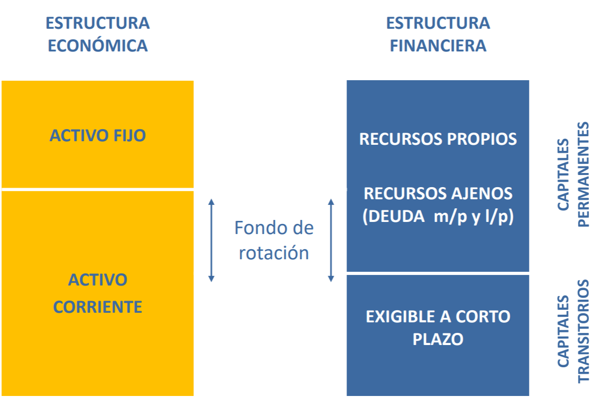

- La estructura económica es todo lo relativo al activo.
- La **estructura financiera** es todo lo relativo a cuestiones del pasivo, de la financiación.

Fondo de rotación = Fondo de maniobra = PN - AC = AC - PC = PF - AF

**TODO: contrastar fórmula de arriba. Viene de Nadia.**
{.red}

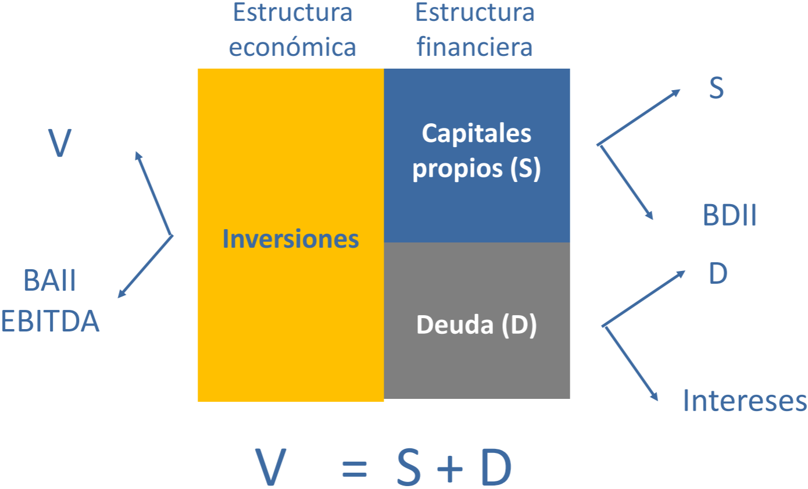

- **V:** valor de la empresa
- **BAII/BAIT:** beneficio antes de intereses e impuestos. Beneficio bruto, generado por los proyectos de inversión.
- **BDII:** beneficio después de intereses e impuestos. Beneficio neto.
- **EBITDA:** Beneficio - ITDA = EBITDA
    - Intereses
    - Tax - Impuestos
    - Depreciaciones
    - Amortizaciones
- **r:** intereses

$V=S+D$

$BAII=BDII+r_d→BDII=BN=BAII-r_d$

## 2. Riesgo y apalancamiento

Apalancamiento financiero: todo lo referido a la utilización de deuda. Cuanta más deuda tenga la empresa, más apalancada estará.

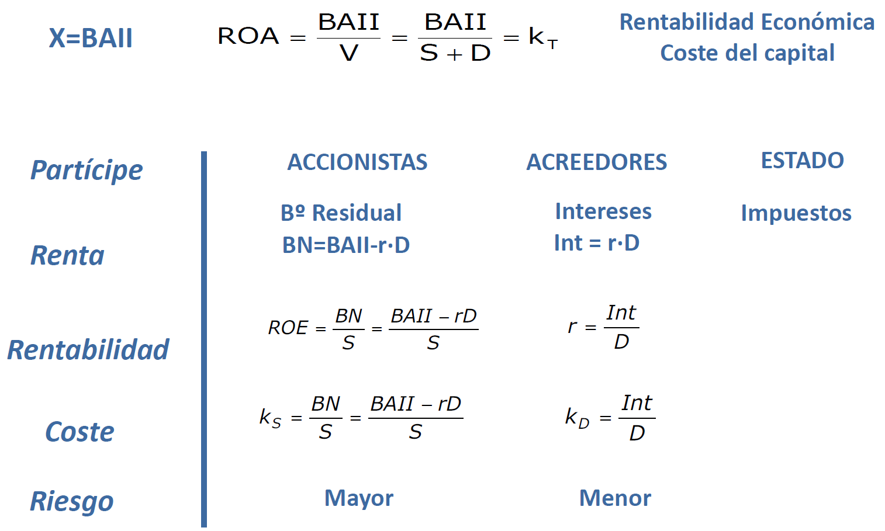

- ROA: *Return on Assets*. Es la **rentabilidad económica** o **coste de capital (k~T~)**.
- BN: *Beneficio neto*. $BN=BAII-rD$

$k_s=k_T+\dfrac{D}{S}(k_T-r)$

$ROE=ROA+\dfrac{D}{S}(ROA-r)$

??? info "Demostración"
    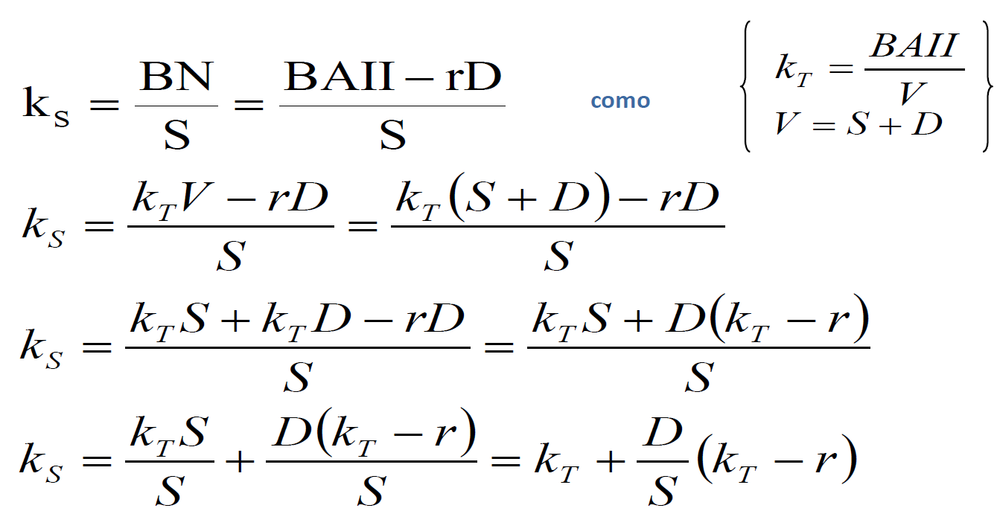

Si no hay deuda:

- $k_S=k_T$
- $ROE=ROA$

Resumen:

- **ROA:** mide la ^^eficiencia de los activos totales de una empresa independientemente de las fuentes de financiación utilizadas y de la carga fiscal^^ (los impuestos se dan en el `tema 3`). ^^Mide la capacidad de los activos de una empresa para generar renta^^.
- *ROE:* mide el ^^rendimiento que obtienen los accionistas de los fondos invertidos en la empresa^^. Trata de captar la capacidad de la empresa para remunerar a sus accionistas. Se utiliza para comparar empresas del mismo sector. Se pueden comparar empresas de distinto sector, pero la fiabilidad es mucho menor que si las empresas son del mismo sector.

??? example "Ejemplo: nueva empresa que tiene que decidir si financiar proyecto de 100 um"
    - A) todo con fondos propios → ROE = ROA
    - B) 10% con fondos propios, 90% de préstamo

    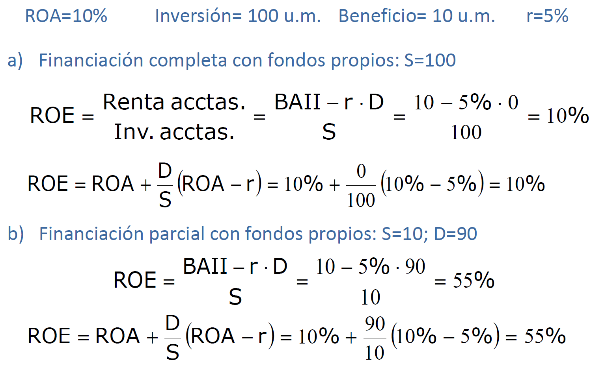

    En el caso `B` los accionistas reclaman más dinero porque la empresa tiene más apalancamiento (**más riesgo**). Recordar que los accionistas son los últimos en cobrar.

Recordar: `Coste capitales propios = Coste del capital + Prima por riesgo`

??? note "De qué depende la rentabilidad que reciben los accionistas?"
    - :fontawesome-solid-caret-up:{.green} Nivel de endeudamiento
    - :fontawesome-solid-caret-up:{.green} Rentabilidad de la empresa
    - :fontawesome-solid-caret-down:{.red} Tipo de interés

### Coste de Capital Medio Ponderado (ccmp)

$ccmp=k_T=\dfrac{S}{S+D}k_S+\dfrac{D}{S+D}k_D$

k~T~ es una media ponderada del coste de capital propio (k~S~) y el coste del capital ajeno (k~D~)

Ahora vemos el riesgo:

- $\sigma(k_S)=\sigma(k_T)+\dfrac{D}{S}\sigma(k_T)=\sigma(k_T)(1+\dfrac{D}{S})\geq \sigma(k_T)$
- Riesgo financiero = Riesgo económico + Riesgo financiero propiamente dicho
    - El `riesgo económico` no depende del endeudamiento
    - El `riesgo financiero` depende del endeudamiento

??? info "Demostraciones (no caen)"
    ccmp:
    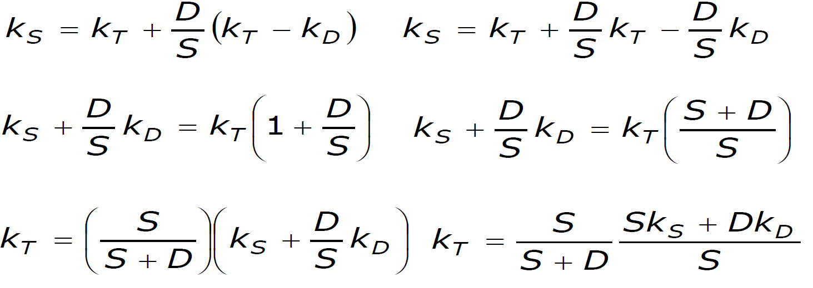

    riesgo:
    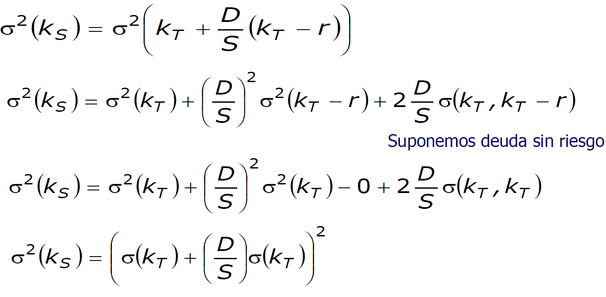

## 3. La posición tradicional

No es una teoría, sólo una mera posición. En 1958 salta por los aires por la publicación de un artículo de *Modigliani* y *Miller*.

Supuestos iniciales:

- Coste del capital ajeno < coste del capital propio (K~D~ < k~S~)
- K~D~ no siempre es independiente del endeudamiento
- K~S~ es creciente con respecto al endeudamiento

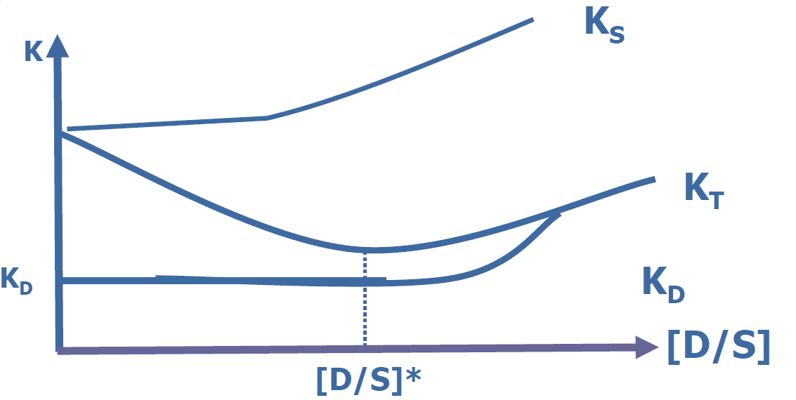

La curva alcanza el mínimo en el punto `[D/S]*` (**punto de endeudamiento óptimo**), donde se **maximiza** el valor de la empresa.

**Críticas:**
{.red}

- Indefinición de estructura óptima
- Supuestos
    - Imperfecciones de los mercados
    - Magnitudes conocidas con certeza
- Carencia de fundamentación teórica

## 4. Estructura de capital en mercados perfectos: las proposiciones de medigliani y miller

En 1958 Modigliani y Miller publican un articulo revolucionario.

- Aplican el **análisis microeconómico a las finanzas** → introducción del mercado como marco de valoración
- El **valor** es d**eterminado únicamente por las decisiones de inversión**, por la capacidad de generar renta.
- La **estructura de capital es irrelevante** y sólo influye en el reparto de los flujos, pero no es su generación.
- Los **derechos sobre el reparto de rentas no determinan su importe**.
- ^^Separación entre las decisiones de inversión y financiación^^.

### `Supuestos base`

1. **Mercados perfectos de capitales**
      1. Información perfecta y acceso sin coste (`mercado eficiente`)
      2. Costes de transacción nulos
      3. Títulos infinitamente divisibles
      4. Comportamiento racional de los inversores
2. Los beneficios se representan por una variable aleatoria que es posible determinar de forma subjetiva. Los inversores coinciden en su determinación.
3. Es posible agrupar a las empresas en clases de riesgo o rendimiento empresarial (*modelo de equilibrio parcial*)
4. No hay **impuestos**.

### `Ideas previas`

- Clases de rendimiento o riesgo empresarial equivalente
- Modelo de equilibrio parcial de mercado (precio → oferta y demanda)
- Tasa de descuento que el mercado fija para descontar los flujos
- El valor es determinado únicamente por las decisiones de inversión
- La estructura de capital sólo influye en el reparto de los flujos, pero no en su generación
- Principio de aditividad del valor

### `Terminología nueva`

- $j$: subíndice de empresa
- $k$: subíndice de clase de riesgo
- $V_j$: valor de mercado de la empresa j
- $S_j$: valor de mercado de las acciones de la empresa j
- $D_j$: valor de mercado de la deuda de la empresa j
- $X$: ==Beneficio==, variable aleatoria
- $\rho_k$: tasa de descuento o ==coste de capital== (antes llamado $k_T$)
- $Y_j$: coste de los capitales propios de la empresa j (antes llamado $Y_j$)
{.magenta}

### `Proposición 1`

!!! quote "Proposición 1"
    El valor de mercado de la empresa y su coste de capital son independientes de su estructura de capital

En equilibrio, para una empresa j ^^perteneciente a la clase de riesgo k^^, su **valor** debería ser:

$$V_j=S_j+D_j=X_j/\rho_k$$

Si dos empresas de la misma clase de riesgo y mismas estructuras de inversión y diferentes estructuras de capital tuviesen **distinto valor** se crearían {++oportunidades de arbitraje++} en el mercado para los inversiones que les permitirían obtener una ganancia adicional. Estas oportunidades conducirían a recuperar el equilibrio en el mercado.

==El arbitraje se produce de la empresa sobrevalorada de a la infravalorada==

!!! example
    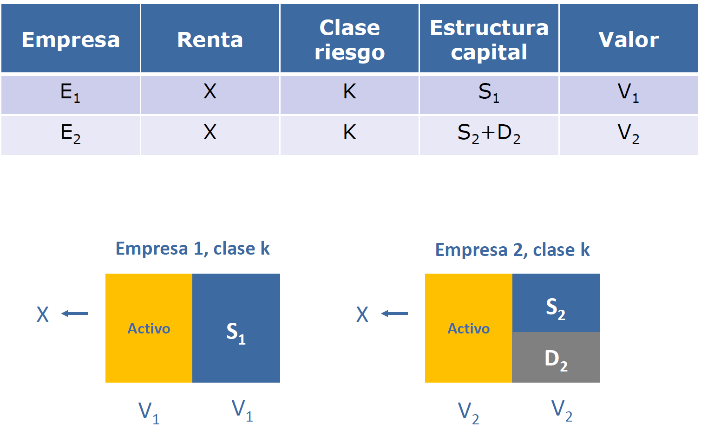

    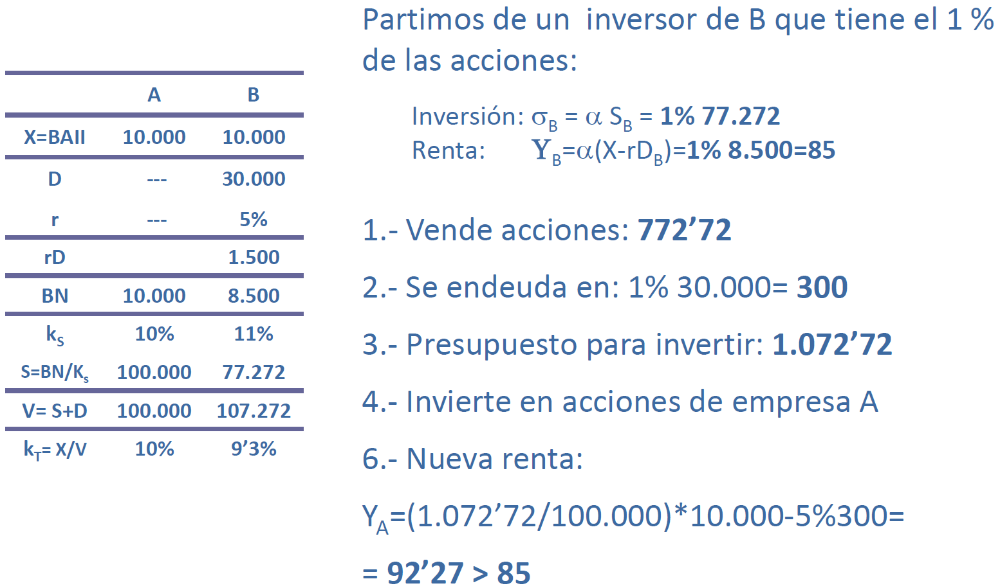

    - k~S~ es un dato que nos dan. `A` retribuye un 10% a los accionistas y `B` un 11%.
    - S es el valor de mercado de las acciones
    - `B` está sobrevalorada
    - El inversor de `B` hace una réplica de su empresa en pequeñito (se endeuda con el 1%)
    - Mucha gente vende acciones de `B` (baja precio de `B`) y compra acciones de `A` (sube precio de `A`) hasta que se igualen
    - Crítica: es muy difícil que al inversor de `B` que se mueve a `A` le den un tipo de interés en el banco igual a la empresa `B`.
    {.red}

!!! example
    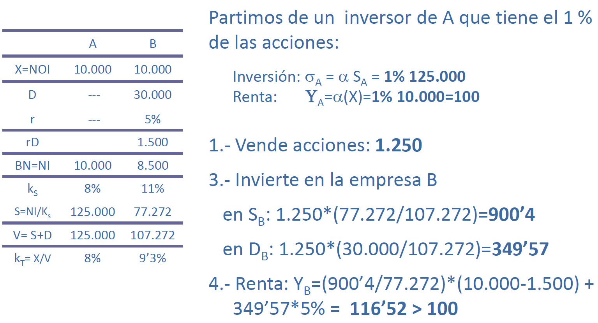

    - Ahora la `A` es la empresa sobrevalorada y se producirá un arbitraje `A→B`

### `Proposición 2`

!!! quote "Proposición 2"
    La tasa de retorno o rentabilidad de una acción es igual a la tasa de capitalización del flujo de renta de una empresa no endeudada perteneciente a la misma clase de riesgo más una prima por el riesgo financiero, equivalente a multiplicar el ratio de endeudamiento por la diferencia entre la tasa de capitalización anterior y el tipo de interés de la deuda.

En equlibrio, para una empresa j perteneciente a la clase de riesgo k la **rentabiliad de sus acciones** debería ser:

$$i_j=\rho_k+\dfrac{D}{S}(\rho_k-r)$$

### `Proposición 3`

!!! quote "Proposición 3"
    La tasa de retorno requerida para los proyectos de inversión es independiente del modo en que se financien las inversiones. Es decir, es independiente de la estructura de capital de la empresa

En equilibrio, para una empresa j perteneciente a la clase de riesgo k la **condición de aceptación de los proyectos** debería ser:

$$TR\geq\rho_k$$
