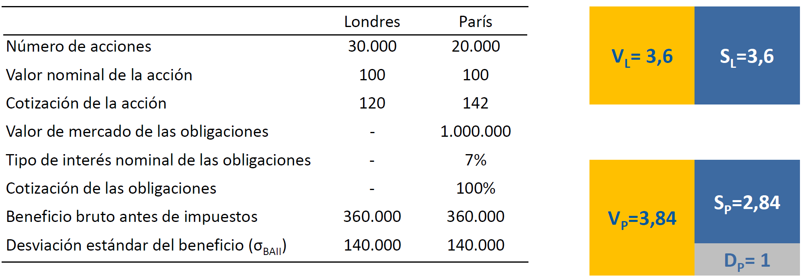
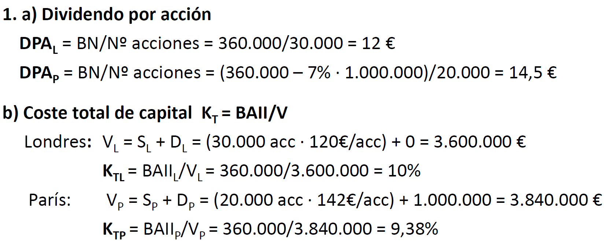
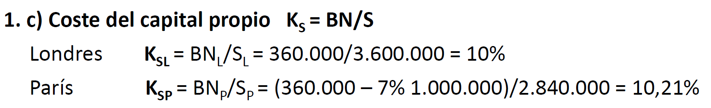
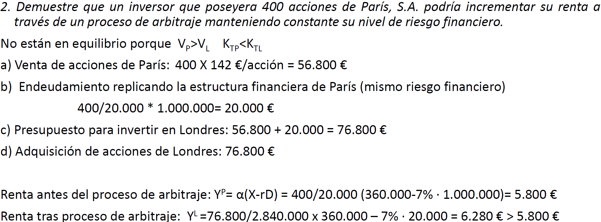

# Problemas tema 2

## `Problema 1`

`Londres SA` y `París SA` son dos empresas pertenecientes a la misma clase de riesgo, que distribuyen íntegramente sus beneficios en forma de dividendos, y de los cuales se ofrece la siguiente información financiera.

Basándose en la teoría de Modigliani y Miller en ausencia de impuestos:

1. **Calcule el dividendo por acción de cada empresa, el coste total de capital y el coste del capital propio.**
2. **Demuestre que un inversor que poseyera 400 acciones de `París SA` podría incrementar su renta a través de un proceso de arbitraje manteniendo constante su nivel de riesgo financiero.**

Tenemos que utilizar el valor de `cotización de la acción`, no el `valor nominal de la acción` (trabajamos a precios de mercado).

No valen lo mismo, por lo que el mercado del sector no está en equilibrio

