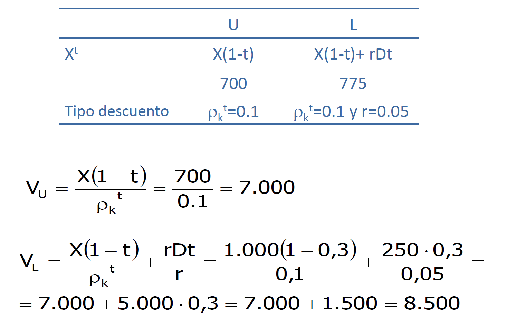

# 3.1. Estructura de capital e impuestos

- Permiten reconciliar posición tradicional y MM
- Impuesto de sociedades (MM, 1963) {>>Revisión<<}
- Impuesto sobre la renta de las personas físicas (Miller, 1977) {>>Revisión<<}

*[MM]: Modigliani y Miller

Parece que metieron parches a su modelo para considerar las imperfecciones (como `impuestos`) y se intentaron acercar a la posición tradicional (**creo**), porque puede que exista un ratio de endeudamiento óptimo.

Receptores del BAII:

1. Acreedores (obligacionistas) `rD`
2. Estado (Agencia Tributaria) `(X-rD)t` {>>los intereses de la deuda son deducibles<<}
3. Accionistas. `X-rD-(X-rD)t = (X-rD)(1-t)`

## Modelo del 63

### Ilustración del nuevo sistema

- `L` es la empresa que tiene deuda (*Leverage*) y `U` la empresa que **no** tiene deuda.
- `X(1-t)` es el **beneficio ajustado fiscalmente**
- `rDt` es el **ahorro impositivo** (lo que la empresa se ahorra por haber emitido deuda)

Las rentas ciertas se actualizan a una tasa $r$ y las inciertas se actualizan a $\rho_k^t$

V~L~ = V~U~ + Valor actual del Ahorro Impositivo

### `Modelo del 55 vs 63`

**IMPORTANTE: MM rompen con su modelo del 58, ya que decían que el valor de las empresas era independiente de su financiación, y en este ejemplo vemos que la empresa con deuda tiene más valor que la empresa sin deuda.**
{.magenta}

- No hay un valor del endeudamiento que maximize el valor de la empresa
- $V_L=V_U$ es el modelo del `55`
- $V_L=V_U+Dt$ es el modelo del `63`

==El modelo del 63 valora más a las empresas endeudadas que las no endeudadas==

<figure>
  
  <figcaption>La tasa de actualización disminuye con `D`</figcaption>
</figure>

### Ejemplo numérico

- La estructura de capital es relevante. Cuanto más endeudamiento el valor de la empresa será mayor.

!!! question "¿Es bueno aumentar excesivamente la deuda para aumentar el valor de la empresa?"
    Las empresas no aumentan su deuda hasta el infinito, ya que al aumentar la deuda aumentan los **costes de insolvencia**.

## Modelo del 77 (Miller)

**El modelo del 63 no incorporaba el IRPF (que afecta a los inversores).**

Denominación:

- $t_{ps}$: tipo de gravámen marginal sobre los rendimientos de las acciones (==propios==)
- $t_{pd}$: tipo de gravámen marginal sobre los rendimientos de la deuda (==ajenos==)
- $t_{pd}>t_{ps}$

### Ejemplo

Como siempre, `U` es la empresa **sin** deuda y `L` es la empresa **con** deuda.

**Notas:**
{.red}

$t_{ps}$
:   Es el IPRF que pagan los accionistas al recibir el diviendo

$t_{pd}$
:   Creo que es el IRPF que tienen que pagar los propietarios de la deuda al recibir los intereses? No le veo mucho sentido...

Al incorporar el IRPF, el ahorro impositivo queda:

$$AI=rD[(q-t_{pd})-(1-t(1-t)(1-t_{ps}))]$$

Calculamos $V_L$ tras actualizar el ahorro impositivo:

$$V_L=V_U+D\left[1-\dfrac{(1-t)(1-t_{ps})}{1-t_{pd}}\right]$$

- Si $t_{ps}=t_{pd}$ → $VA(AI)=Dt$
- Si $t_{ps}>t_{pd}$ → :fontawesome-solid-caret-down:{: .red}$VA(AI)$
- Si $t_{ps}<t_{pd}$ → :fontawesome-solid-caret-up:{: .green}$VA(AI)$
- Si $(1-t)(t-t_{ps}>(1-t_{pd})$ → $VA(AI)<0$ → **La empresa con deuda vale menos!!!**

En equilibrio:

$$(1- t_{pd})=(1- t)(1- t_{ps})$$

`Hipótesis`
:   Hay un volumend e deuda óptimo (que hace que la estructura financiera sea irrelevante)
Importancia de la estructura de propiedad.

`Truco`
:   Al objeto de hacer máximo el valor de los impuestos ahorrados y maximizar la renta total disponible para los inversores la empresa va a ofrecer sus bonos (obligaciones) a instituciones y/o personas exentas de tributar en el IRPF o con bajos niveles de renta (Hacienda les hace pagar poco). 
Después ofrecería acciones a instituciones y/o personas exentas de tributar en el IRPF o con bajos niveles de renta.

!!! quote
    Al tener en cuenta conjuntamente `IS` e `IRPF` existirá un ratio óptimo para el sistema empresarial en su conjunto, no para cada empresa en particular.
