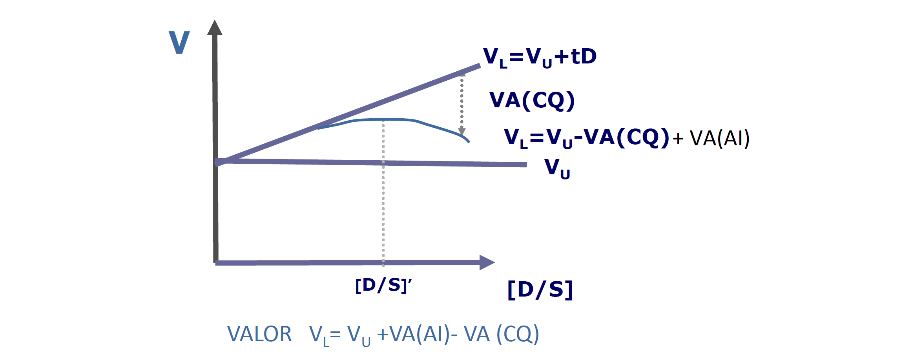

# 3.2. Estructura de capital y costes de solvencia

No se puede aumentar la deuda indefinidamente: ahora consideraremos los costes de insolvencia (o de quiebra).

## Costes de insolvencia o quiebra

`La probabilidad de insolvencia no es 0:`

$$p[X<rD]>0$$

^^Introducimos los costes de insolvencia:^^

$$V_L=V_U+VA(AI)-VA(CQ)$$

**Para niveles muy bajos de endeudamiento no se consideran los costes de quiebra.**
{.magenta}

**Teoría estática del *trade-off*:** ^^todas las empresas alcanzarán un valor de endeudamiento óptimo que maximiza el valor de la empresa^^ (volvemos al enfoque tradicional). El nivel de endeudamiento óptimo viene ^^determinado por un *trade-off* entre los costes y los beneficios que provoca el endeudamiento^^. Es el equilibrio de las ventajas y los inconvenientes del endeudamiento.

==En economía financiera la teoría del *trade-off* defiende que las empresas tienen una estructura de capital óptima y por lo tanto un ratio de endeudamiento óptimo que maximiza el valor de la empresa.==
