# Problemas tema 3

## `Problema 2 - Excelsa`

`EXCELSA` es una empresa del sector de la alimentación cuyo consejo de administración está estudiando la repercusión de las distintas alternativas de financiación de las inversiones en el coste de capital de la empresa, en su carga fiscal y en su valor de mercado. En este sentido, se dispone de los siguientes datos acerca de la misma:

- El beneficio anual antes de intereses e impuestos de `EXCELSA`, S.A. asciende a 8 millones de euros.
- A efectos fiscales el tipo de gravamen que soporta la empresa en el impuesto de sociedades es el 35% de su base imponible.
- El impuesto de la renta grava de forma diferenciada los rendimientos según su fuente de obtención. Así, el tipo de gravamen sobre los rendimientos del capital-acciones es el 15%, mientras que el tipo de gravamen de los rendimientos del capital-obligaciones es el 40%.
- Hasta el momento, `EXCELSA` había sido una empresa sin deuda en su estructura de capital. Sin embargo, y al objeto de incrementar la riqueza de sus accionistas, acaba de realizar una emisión de obligaciones al 10% por importe de 16 millones de euros ==con los cuales ha recomprado el 25% de sus propias acciones manteniendo inalterada su estructura de inversión.==
- A partir de estos datos el consejo de administración de `EXCELSA` encarga al director financiero que elabore un informe para dar respuesta a los siguientes interrogantes:
    1. En el supuesto de que se verificase la teoría de Modigliani y Miller (MM) sin impuestos, ¿cuál sería el coste del capital propio de `EXCELSA` antes y después de la emisión de deuda?, ¿y el coste de capital medio ponderado?
    2. ¿Cuánto valdría en términos actuales el ahorro impositivo que obtendría `EXCELSA` tras la emisión de deuda al ser los intereses de la deuda gasto deducible en la base imponible del impuesto de sociedades? Calcúlese también el valor de mercado de `EXCELSA` antes y después de la emisión de deuda.
    3. Si `EXCELSA` tuviese en cuenta el efecto conjunto de los impuestos de sociedades y sobre la renta de las personas físicas, ¿cómo habría que modificar los cálculos efectuados en el apartado anterior?
    4. ¿Para qué tipo marginal de gravamen sobre los rendimientos del capital-obligaciones sería nulo el valor actual del ahorro impositivo calculado en el apartado anterior? En este caso, ha de suponerse que los demás tipos impositivos son constantes.

### Solución 2

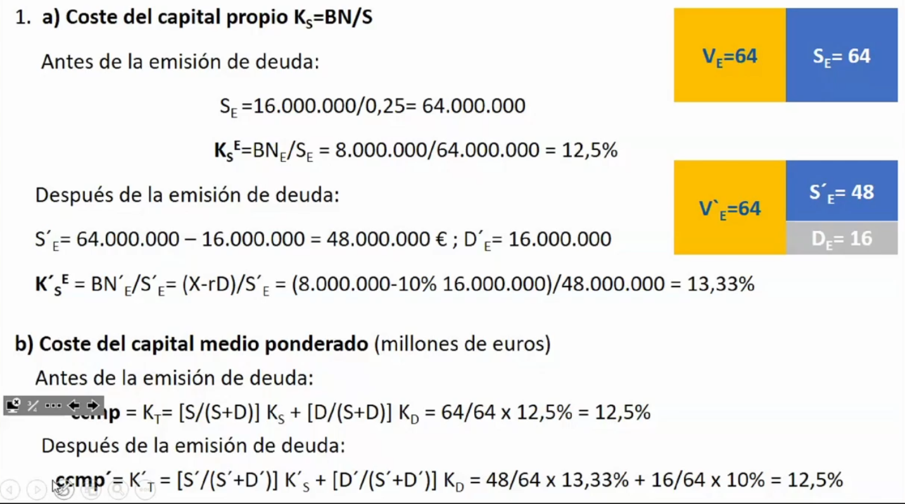

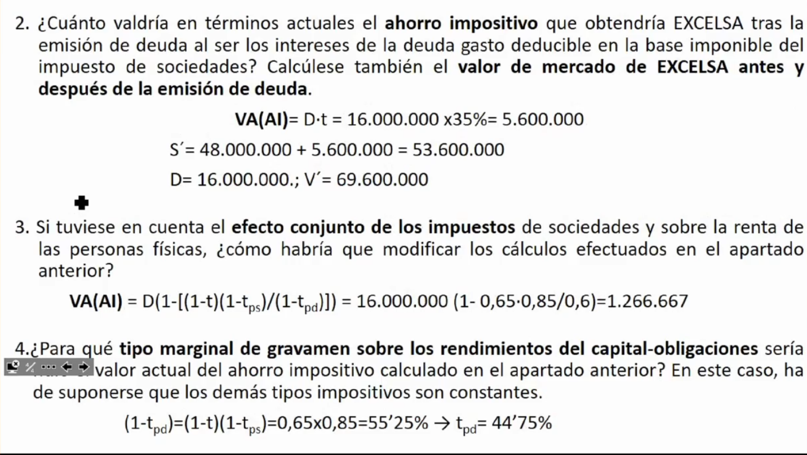

**Es irrelevante la estrucutra del capital de la empresa (por el efecto conjunto de los dos impuestos).**

## `Problema 3 - Ave y Cren`

De la lectura de un reciente boletín económico-financiero se desprende la siguiente información respecto a las empresas AVE y CREN que pertenecen a la misma clase de riesgo:

| Valores en euros                            |    AVE    |    CREN    |
| ------------------------------------------- | :-------: | :--------: |
| Valor nominal de la acción                  |    500    |    500     |
| Número de acciones                          |  17.000   |   13.000   |
| Cotización de la acción                     |   3.125   |   2.125    |
| Valor de mercado de las obligaciones        |     -     | 23.200.000 |
| Tipo de interés nominal de las obligaciones |     -     |    0'10    |
| Beneficio neto antes de impuestos           | 8.500.000 | 5.812.000  |

También se sabe que el tipo de gravamen en el impuesto de sociedades es el 30%, y que los tipos sobre los rendimientos del capital-acciones y del capital-obligaciones en el impuesto sobre la renta son, respectivamente, el 15% y el 55%. El beneficio se reparte íntegramente en forma de dividendos y que las obligaciones cotizan a la par. A la vista de tal información, se pide:

1. Probar que las empresas AVE y CREN se encuentran en la situación de equilibrio definida por Modigliani y Miller (sin impuestos).
2. Calcular el valor actual del ahorro impositivo que obtendría la empresa CREN si los intereses fuesen gastos deducibles de la base imponible del impuesto de sociedades.
3. ¿Cuál sería el valor actual del ahorro impositivo si CREN tuviese en cuenta el efecto conjunto del impuesto de sociedades y del impuesto sobre la renta de las personas físicas?
4. ¿Para qué tipo marginal de gravamen sobre los rendimientos del capital-obligaciones sería nulo el valor actual del ahorro impositivo calculado en el apartado anterior? Suponga constantes los demás tipos impositivos.

### Solución 3

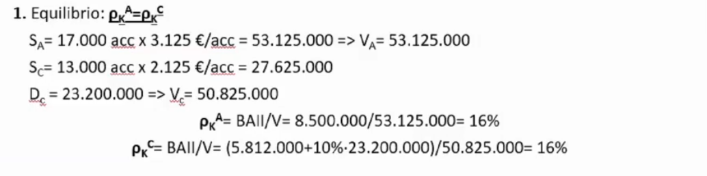

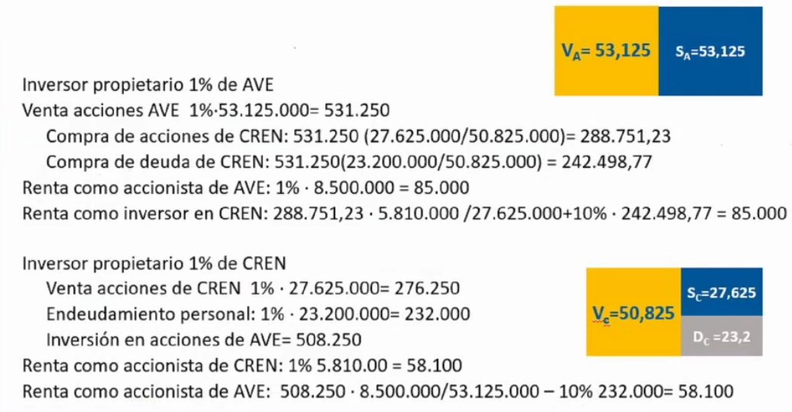

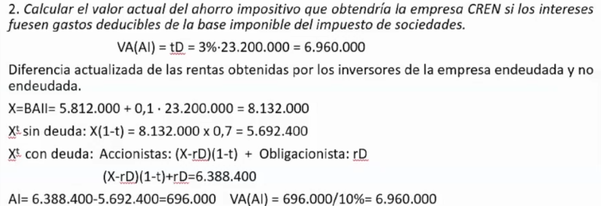

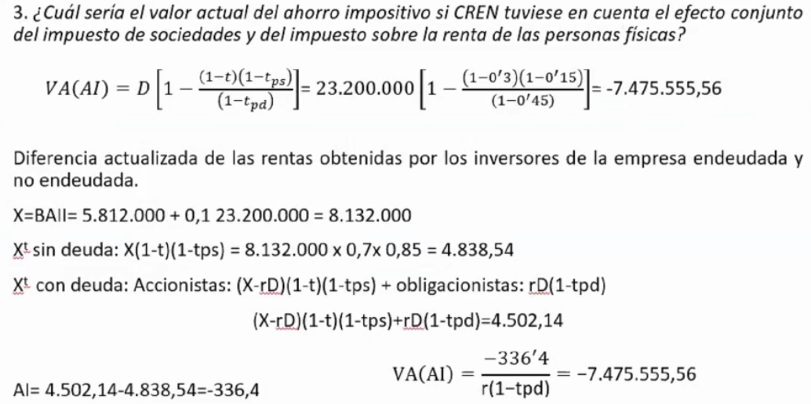

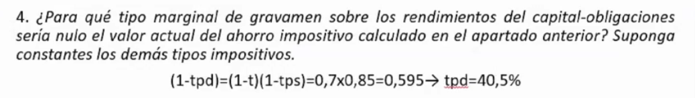

## `Problema 4 - Eva y Num`

:warning: **El enunciado de este problema tiene algo mal** :warning: 
:octicons-check-24: *Las fotos están bien* :octicons-check-24:

Considere dos empresas (`EVA S.A.` y `NUM S.A.`) pertenecientes a la misma clase de riesgo y que cotizan en un mercado de capitales perfecto en equilibrio. La empresa `EVASA` se financia únicamente con capitales propios y la empresa `NUMSA` se financia al 50% con capitales propios y el resto con deuda cotizada a la par y tipo de interés igual al 5%. Se dispone de la siguiente información (valores en euros):

| Valores en euros                                | `EVASA` | `NUMSA` |
| ----------------------------------------------- | :-----: | :-----: |
| Valor nominal de las acciones                   |    6    |   12    |
| Número de acciones                              |  4.000  |  1.000  |
| Cotización de la acción                         |    8    |    ?    |
| Valor de mercado de la deuda                    |    -    |    ?    |
| Beneficio antes de intereses e impuestos (BAII) |  3.200  |  4.000  |

Con esta información determine:

1. La cotización de la empresa `NUMSA`. Trabaje ahora teniendo en cuenta la existencia de un impuesto sobre la renta societaria del 35%. Tomando como dado el valor de la deuda obtenido en el apartado anterior, calcule:
2. La cotización de la empresa `NUMSA`.
3. Coste del capital de `EVASA` y `NUMSA`.
4. Coste del capital propio de `EVASA` y de `NUMSA`. Considere también la existencia de un impuesto sobre las rentas que perciben los inversores del 30% para los rendimientos de la deuda y del 20% para los rendimientos de las acciones. Se pide:
5. La cotización de la empresa `NUMSA`.
6. Coste del capital de `EVASA` y `NUMSA`.
7. Coste del capital propio de `EVASA` y de `NUMSA`.
8. Rentabilidad que perciben los inversores de `NUMSA`.
9. Valor del cambio en el ahorro impositivo generado en la empresa `NUMSA`.

### Solución 4

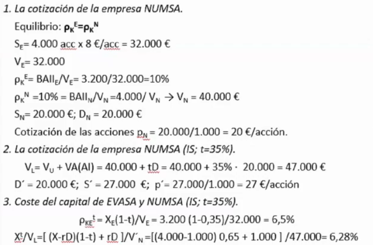

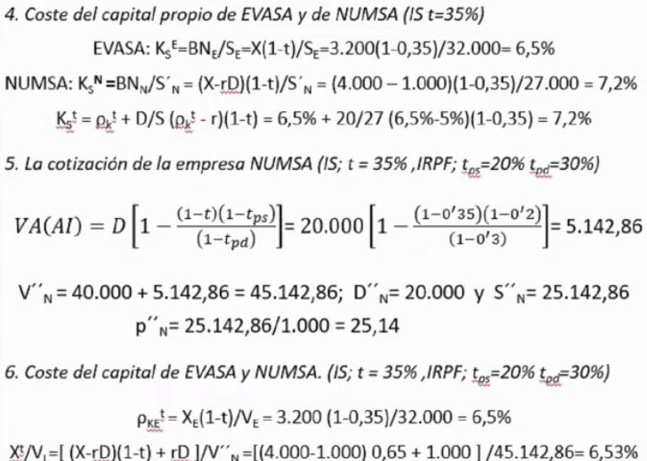

 

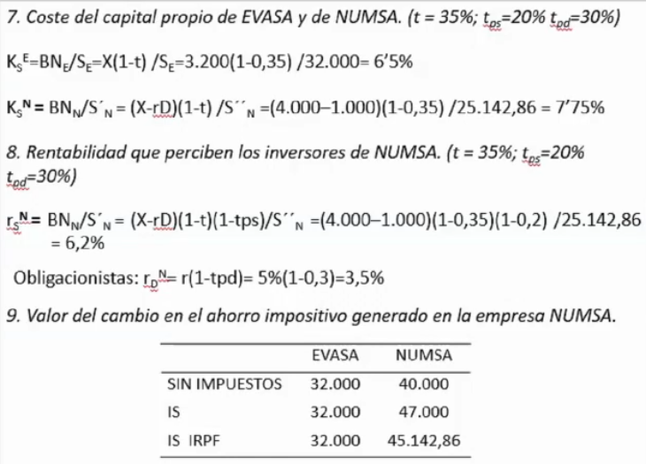

## `Problema 5 - Peñalara (Junio 2018)`

Peñalara, S.A. es una empresa española de naturaleza familiar cuyas acciones y deuda están valoradas en 3’1 y 1’5 millones de euros, respectivamente. En este valor se ha tenido en cuenta que el tipo de gravamen del impuesto de sociedades (IS) es el 25%. El tipo de interés de la deuda (que cotiza a la par) es el 7% y el beneficio bruto es de medio millón de euros.

1. ¿Cuál es el coste de capital de la empresa?
2. Considere ahora el efecto conjunto del IS y del IRPF. Si en este último impuesto los tipos de gravamen de los rendimientos de las acciones y de la deuda son 18% y 24%, respectivamente, ¿cuál será el valor de la empresa? Justifique este resultado comparándolo con el valor inicial de la empresa.
3. ¿Cuál sería la rentabilidad de los accionistas en este último caso?

### Solución 5

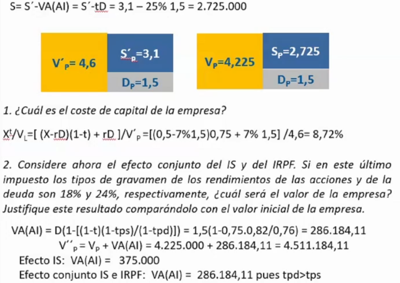

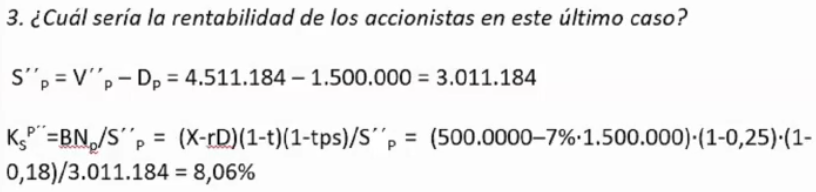

## `Problema 6 - Pego y Jara`

Pego y Jara son dos empresas del mismo sector que se puede considerar que se encuentra en equilibrio: madereras dedicadas a la explotación y comercialización de la madera en diversos estados de transformación para el abastecimiento de otras industrias. En los últimos años, el auge del sector de la construcción ha dado lugar a que su línea de actividad principal sea la producción y venta de palets, que se utilizan para el transporte de diversos tipos de materiales de construcción.

El desarrollo de esta actividad ha dado lugar a la realización de diversas inversiones cuya financiación ha estado parcialmente basada en el endeudamiento. Ahora bien, la intensidad en el empleo de deuda es diferente en ambas empresas y, por tanto, diferente también el beneficio fiscal que obtienen. Actualmente, tras considerar las ventajas fiscales, los ratios de endeudamiento financiero (deuda / recursos propios) ascienden al 25% en la empresa PEGO y el 100% en la empresa JARA. El tipo de gravamen del Impuesto de Sociedades se sitúa en el 30%.

El bajo nivel de deuda y la capacidad de autofinanciar sus operaciones proporcionan a PEGO la consideración de una de las empresas más solventes del sector. De ahí que la calificación de su deuda sea muy elevada y la rentabilidad de sus obligacionistas se sitúe en el 6,5%, un 1,5% superior a la del activo libre de riesgo. Actualmente, el valor de mercado de la empresa PEGO es 75.000 millones de euros.
La política más intensiva en el uso de financiación ajena de JARA respondió principalmente al objetivo de deducir gastos financieros y apropiarse de las ventajas fiscales. El mayor riesgo asociado a las obligaciones emitidas por JARA encuentra reflejo en la rentabilidad ofrecida a sus obligacionistas que asciende al 9%.

Además, el beneficio antes de intereses y de impuestos asciende a 8.460 y 8.160 millones de euros para PEGO y JARA respectivamente.

Con estos datos se le pide:

1. Valor de mercado de los activos, de las acciones y de la deuda de PEGO y JARA.
2. Coste del capital y coste del capital propio de ambas empresas.

### Solución 6

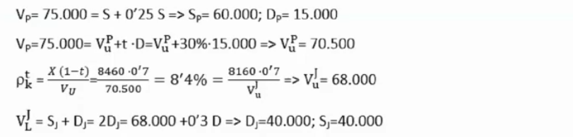

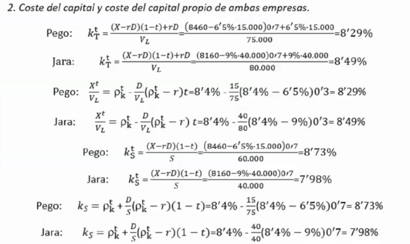

## `Problema 7 - Roma`

Roma, S.A. es una empresa cuyos títulos (tanto acciones como obligaciones) se negocian en los mercados de capitales. Su director financiero ha calculado que la relaciónexistente entre el valor de mercado de la empresa en unidades de mil (V) y su ratio de endeudamiento (D/S) puede expresarse como V=2500(D/S)[3-(D/S)].

El beneficio antes de intereses e impuestos del último ejercicio ha sido de 1.125.000 euros. La empresa sigue una política de dividendos consistente en repartir íntegramente sus beneficios. El tipo de interés de la deuda es el 15%. Si suponemos que el beneficio se mantendrá constante durante los próximos años y, bajo las condiciones del planteamiento tradicional de las finanzas,

1. ¿Cuál será la estructura óptima de capital para la empresa?
2. ¿A cuánto ascenderá el valor de sus acciones?
3. ¿Cuál sería su coste de capital mínimo?
4. Si manteniendo constante su estructura de capital Roma, S.A consiguiese aumentar la rentabilidad de la inversión en un 20%, ¿cómo se vería afectada su rentabilidad financiera?
5. Y, si en el caso anterior, como consecuencia del mayor riesgo de las inversiones, los obligacionistas requiriesen un tipo de interés del 16’5%, ¿cuál sería la rentabilidad por dividendos de los accionistas?

### Solución 7

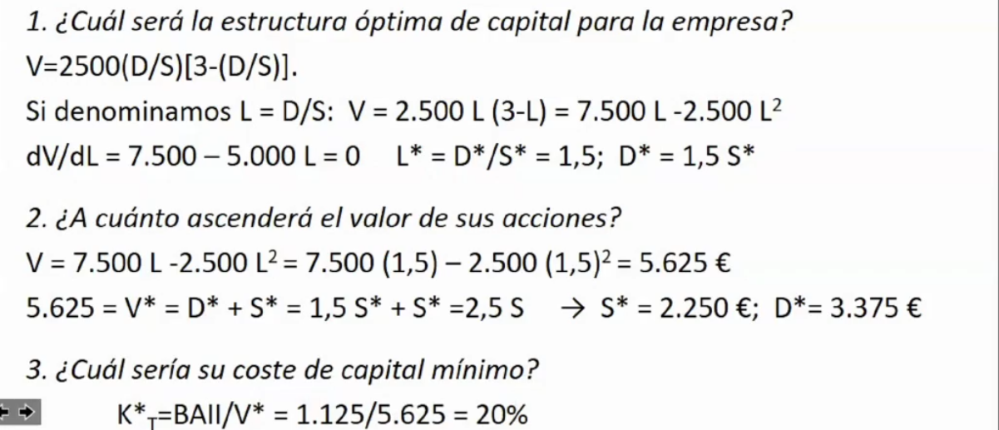

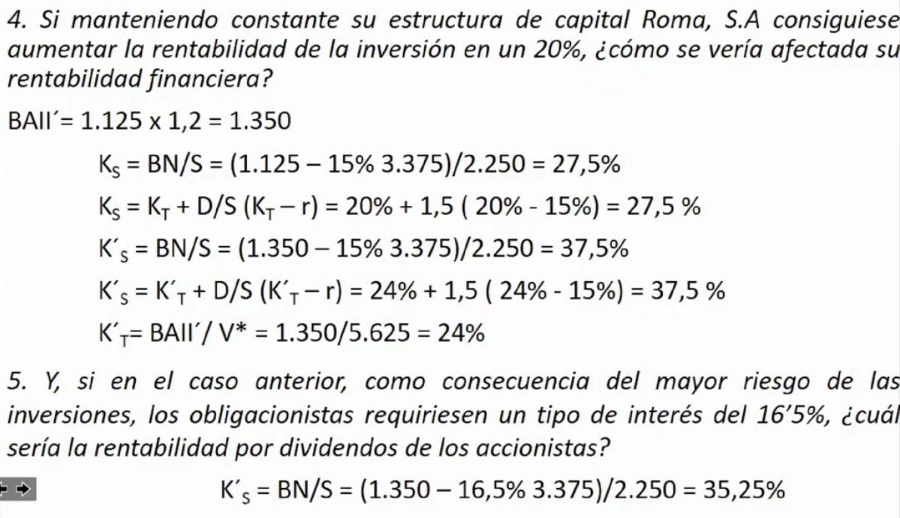

## `Problema 8 - Amarillo (Junio 2018)`

Amarillo, S.A. es una empresa mediana financiada exclusivamente con recursos propios valorados en 1’6 millones de euros, y cuyo beneficio bruto es de un cuarto de millón de euros. Tras haber estudiado las ventajas e inconvenientes del endeudamiento, su director financiero ha decidido emitir deuda al 4% para amortizar acciones sin alterar el activo de la empresa. Para tomar esta decisión ha tenido en cuenta que el tipo de gravamen del impuesto de sociedades (IS) es el 25% y que, cuando el valor de la deuda (D) supera el 50% de los fondos propios, aparecen unos costes de quiebra cuyo valor actual viene dado por la siguiente expresión:

$$VA(CQ)=\left(-\dfrac{D}{2\cdot10^6}+\dfrac{D^2}{6\cdot10^6}\right)$$

1. ¿Cuál sería la cantidad óptima de deuda que esta empresa debería utilizar? ¿Cuál sería el valor máximo de la empresa?
2. ¿Cuál es el mínimo coste de capital que puede alcanzar la empresa?
3. Suponga ahora que, independientemente de los resultados anteriores, la empresa ha decidido pedir prestado un millón de euros. Si omitiéramos el efecto de los costes de quiebra, ¿cuál sería el valor de la empresa y el coste de los fondos propios?
4. Considere ahora el efecto conjunto del IS y del IRPF. Si los tipos de gravamen de los rendimientos de las acciones y de la deuda en este último impuesto son 15% y 30%, ¿cuál sería el valor de la empresa? Justifique las diferencias con los resultados del apartado anterior.
